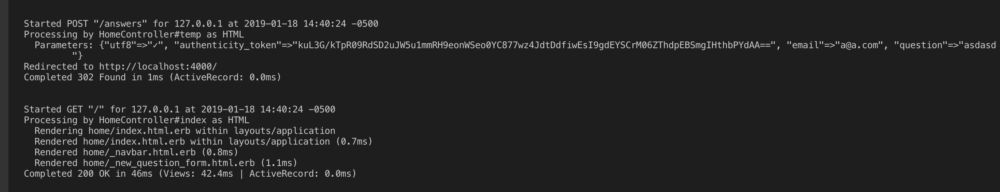

$ rails new <project>
$ rails server      # rails s


http://localhost:3000/rails/info/properties


```
Started GET "/rails/info/properties" for 127.0.0.1 at 2018-12-28 06:25:45 -0500
Processing by Rails::InfoController#properties as HTML
  Rendering /var/lib/gems/2.3.0/gems/railties-5.2.2/lib/rails/templates/rails/info/properties.html.erb within layouts/application
  Rendered /var/lib/gems/2.3.0/gems/railties-5.2.2/lib/rails/templates/rails/info/properties.html.erb within layouts/application (0.6ms)
Completed 200 OK in 106ms (Views: 7.1ms | ActiveRecord: 1.3ms)

```


### generate controllers

$ `rails generate controller home index`
                             [name] [list of actions]


```
lenny@hp:~/HU$ rails generate controller home index
      create  app/controllers/home_controller.rb
       route  get 'home/index'
      invoke  erb
      create    app/views/home
      create    app/views/home/index.html.erb
      invoke  test_unit
      create    test/controllers/home_controller_test.rb
      invoke  helper
      create    app/helpers/home_helper.rb
      invoke    test_unit
      invoke  assets
      invoke    coffee
      create      app/assets/javascripts/home.coffee
      invoke    scss
      create      app/assets/stylesheets/home.scss

```


NOTE:
*.rhtml* with Rails 2 and below
*html.erb* starting Rails3

Edit template:
 `/home/lenny/HU/app/views/home/index.html.erb`

Change this to our default index at /

- /home/lenny/HU/config/routes.rb

handler: `get 'home/index'`

replace with: `root 'home#index'`

Adding routes manually:

1. add to `routes.rb`
   `get '/about' => 'home#about'`

2. `home_controller.rb`
    must add it here even tough it's empty

    ```
    def about
    end
    ```

3. create a new file `views/home/about.html.erb`
   add some HTML


#### Layouts: globally applied to all templates

`views/layouts/application.html.erb`


#### Partials

reusable pieces of view
not rendered on their own
always included from another view

rendering a partial:
`<%= render 'home/new_question_form' %>`

## questions form and route


## answers form and route

