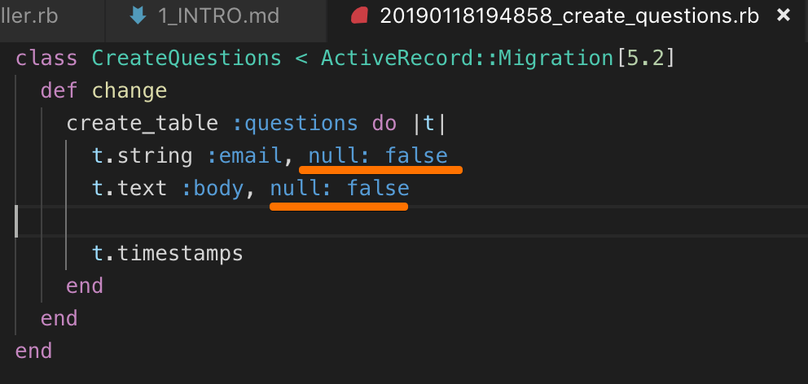
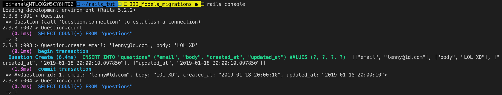

generate a model

`rails g model question email:string body:text`

same, but with RESTful routes

`rails g resource question email:string body:text`
-> generates migration in `db/migrate/...`
-> generates model in `models/question.rb`
edit the migration



## run the migrations

`rake db:migrate`

`rails console`



ActiveRecord lines
get translated to SQL

** in rails, all @instance variables are available in the views **

```
class HomeController < ApplicationController
  def index
    @questions = Question.all
  end
  ...
```

```
<div class="container">
  <% @questions.each do |q| %>
    ...
    # method
    <%= q.gravatar %>" width="80" height="80">

    # props
    <%= q.email %> said:
        <%= q.body %>
```


### RAILS helpers
built-in helper: `time_ago_in_words`
`<%= time_ago_in_words q.created_at %>`