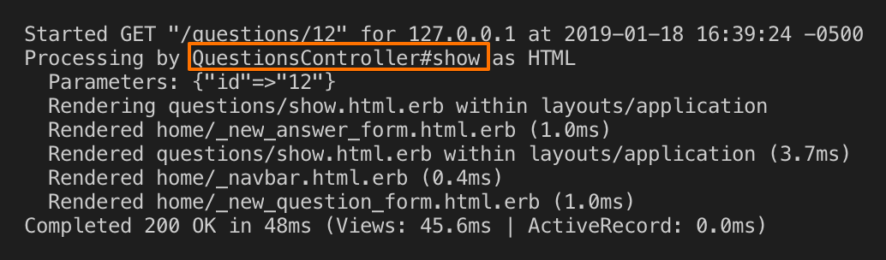
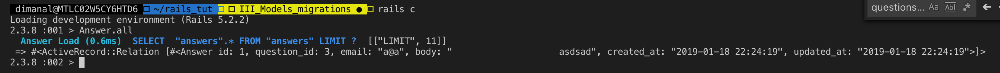

generate a model

`rails g model question email:string body:text`

same, but with RESTful routes

`rails g resource question email:string body:text`
-> generates migration in `db/migrate/...`
-> generates model in `models/question.rb`
edit the migration


## run the migrations

`rake db:migrate`

`rails console`


ActiveRecord lines
get translated to SQL

** in rails, all @instance variables are available in the views **

```
class HomeController < ApplicationController
  def index
    @questions = Question.all
  end
  ...
```

```
<div class="container">
  <% @questions.each do |q| %>
    ...
    # method
    <%= q.gravatar %>" width="80" height="80">

    # props
    <%= q.email %> said:
        <%= q.body %>
```


### RAILS helpers
built-in helper: `time_ago_in_words`
`<%= time_ago_in_words q.created_at %>`


### Rails handles routes by convention

`routes.rb`
  ...
  `resources :questions`
  
  -> this will handle all requests for question


form submit points to
`/questions`,
need to edit `QuestionsController` (which was generated before)

when submit form


include a `create` method


```
Started POST "/questions" for 127.0.0.1 at screens/2019-01-18 16:22:52 -0500
Processing by QuestionsController#create as HTML
  Parameters: {"utf8"=>"✓", "authenticity_token"=>"WWgwKWBm8THHfamGMVKa0IdlX5cA3G0Q5adBk4/J+yMhqVc22JJu8680anJu4kkfqGrPDZyilNgiN+mqQAJTJw==", "email"=>"a@a.co", "question"=>"asdasd                        "}
No template found for QuestionsController#create, rendering head :no_content
Completed 204 No Content in 99ms (ActiveRecord: 0.0ms)
```

***

from `{"email"=>"a@a.co", "question"=>"asdasd"}` to 
`"question"=>{"email"=>"a@a.com", "body"=>"asdasdasd"}}`

`<input name="question[email]">`

***


```
Started GET "/questions/12" for 127.0.0.1 at screens/2019-01-18 16:33:20 -0500

AbstractController::ActionNotFound (The action 'show' could not be found for QuestionsController):
```

*rails expects 'show' method from the controller


-> move `views/home/question.html.erb` to 
`questions/show.html.erb`




informative errors:


we can see all of the routes for question resource
but none defined for answers

### generate an answer resource

1. generate resource
` rails g resource answer question_id:integer email:string body:text`

2. migrate
`rake db:migrate`

*NOTE*
`rake routes` - to see all routes


3. define `create`, `show`, etc


4. make sure form params follow the structure expected
by the controller's safe param method


5. ... and all required params are supplied


6.verify





## relationship

a question has many answers

`models/question.rb`
```
class Question < ApplicationRecord
    has_many :answers

    def gravatar
    ...
```

`models/answer.rb`
```
class Answer < ApplicationRecord
    belongs_to :question
end
```

 


*answers view working*
